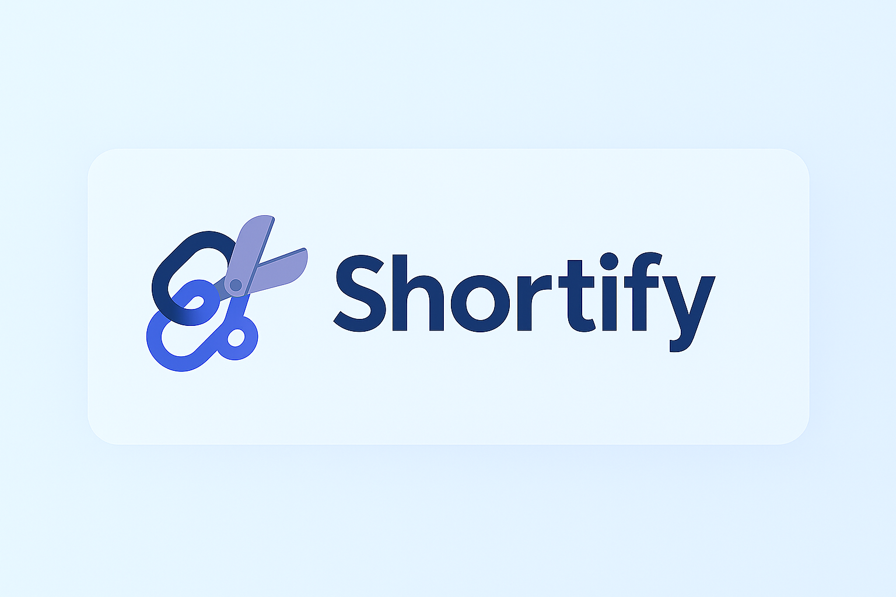

# Shortify
<p align="center"></p>
<div align="center">
- 🔗 Shortify는 긴 링크를 간편하게 줄여주는 크롬 확장 프로그램입니다. <br>
- 쉽고 빠르게 링크를 줄이고, 이전 사용 내역도 확인해보세요. <br>
</div>

## 💡주요 서비스 내용
- ✅ 긴 URL → 짧은 링크로 변환
- ✅ 짧은 링크 클릭 시 원본 페이지로 리디렉션
- ✅ 링크 생성/관리 API 제공
- ✅ Chrome 확장 UI로 쉽게 사용
- ✅ 서버리스 구조로 유지비 최소화

### 🔹 Active 탭
- COPY 버튼으로 짧은 URL을 복사해보세요 <br>
- CREATE NEW 버튼을 누르면 새로운 URL을 줄일 수 있어요 <br>

<p align="center"></p>

### 🔹 History 탭
- 최근에 줄인 URL 최신 3건을 확인하고 복사할 수 있어요
<p align="center"></p>


## 서비스 구조
- 추후 README.md  수정
- 사용자 → Chrome 확장 → URL 입력 → 짧은 URL 발급
- 사용자가 짧은 URL을 클릭하면 → 원래 주소로 리다이렉트


## 사용 기술 및 스택
AWS 기반 시스템 아키텍처 구성

### 1. 백엔드 API: `AWS Lambda` 

- URL 단축 생성/조회 등의 로직 처리
- Lambda는 서버리스 기반으로 관리가 필요 없음

### 2. 데이터 저장소: `DynamoDB` 

- 단축 URL ↔ 원본 URL 매핑 저장
- DynamoDB는 NoSQL 기반으로 빠르고 확장성 뛰어남

### 3. API 엔드포인트: `Amazon API Gateway`

- Lambda와 연결되어 URL 요청을 받아 처리
- RESTful 엔드포인트 제공

### 4. 리디렉션 처리: `Lambda + API Gateway`

- `/s/{shortId}` 형태로 요청 시 Lambda에서 원본 URL 조회 후 리디렉션 응답

### 5. 정적 리소스 저장: `Amazon S3` (선택)

- 크롬 확장 관련 아이콘, 정적 문서, 마케팅 페이지 저장
- 정적 웹 호스팅 지원

### 6. 인증/제한 기능: `AWS Cognito` 또는 `API Key` (선택)

- 로그인 기능이 필요한 경우 Cognito 사용
- 유료 플랜/사용량 제한 기능 구현 시 API Key 기반 접근 제어 가능


## 🛠️ URL 단축 방식 (기술적 설명)

### 🔑 1. 해시 기반 ID 생성

- 원본 URL을 SHA-256 또는 MurmurHash3 등으로 해싱
- 앞의 몇 글자만 잘라서 짧은 ID로 사용 (예: `abc123`)
- 중복 방지를 위해 이미 저장된 해시인지 확인 후 재사용

```javascript
const shortId = createHash('sha256').update(originalUrl).digest('hex').slice(0, 6);
```

## 📌 향후 계획
- URL 공유 기능 (SNS, 이메일 등)
- 즐겨찾기 기능 추가

### 🥠 포춘쿠키 기능 추가 예정
- 랜덤 명언 또는 행운의 메시지 제공
- 가볍게 웃으며 하루를 시작할 수 있는 작은 보너스!

  
