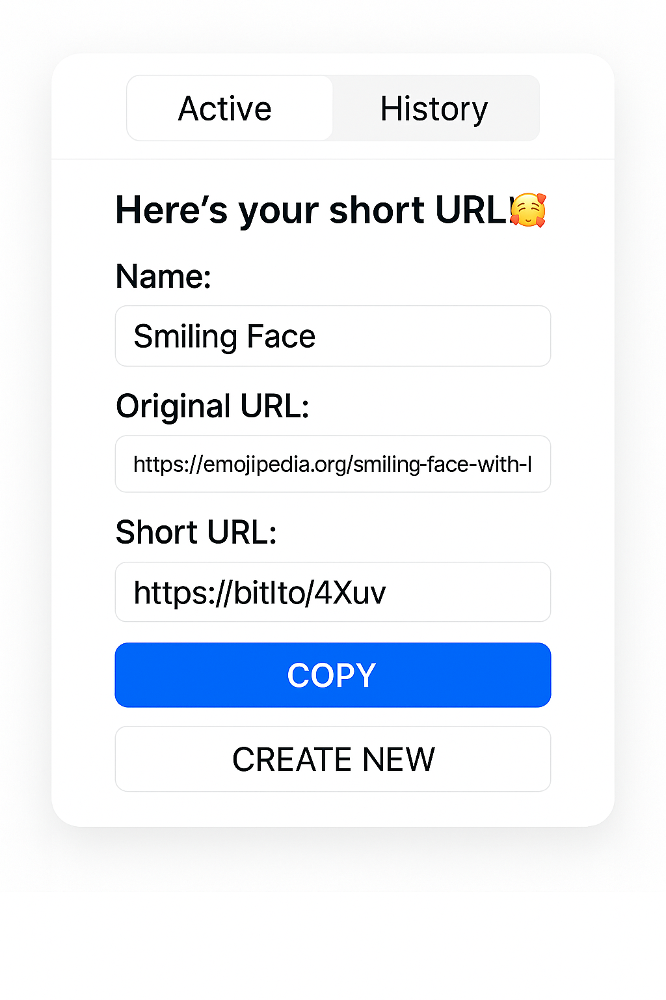
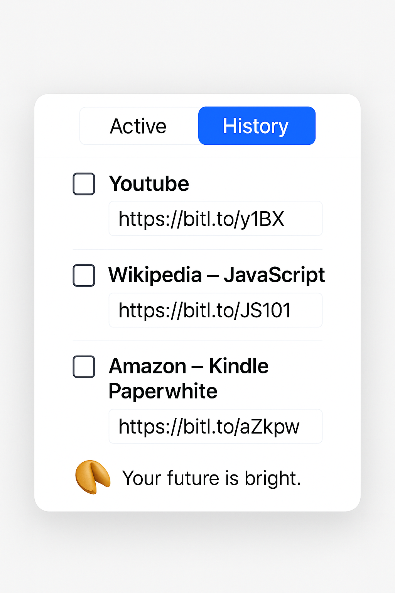

# URLTrimmy

- 🔗 Shortify는 긴 링크를 간편하게 줄여주는 크롬 확장 프로그램입니다.  
- 쉽고 빠르게 링크를 줄이고, 이전 사용 내역도 확인해보세요.  
- 포춘 쿠키 기능을 추가했습니다.  

## 💡주요 서비스 내용

### 🔹 Active 탭
- 현재 사이트의 페이지 제목, 기존 URL, 줄인 URL 표시  
- COPY 버튼으로 짧은 URL을 한 번에 복사  
- CREATE NEW 버튼을 누르면 새로운 URL을 줄여 생성 가능 

### 🔹 History 탭
- 최근에 줄인 URL 최신 3건을 확인하고 복사
- 각각의 링크는 COPY 버튼으로 복사 가능

### 🥠 포춘쿠키 기능
- 랜덤 명언 또는 행운의 메시지 제공
- 가볍게 웃으며 하루를 시작할 수 있는 작은 보너스!

## 사용 기술 및 스택
- 추후 README.me 수정

## 서비스 구조
- 추후 README.md  수정

## 📌 향후 계획
- 짧은 URL 공유 기능 (SNS, 이메일 등)
- 즐겨찾기 기능 추가

  
